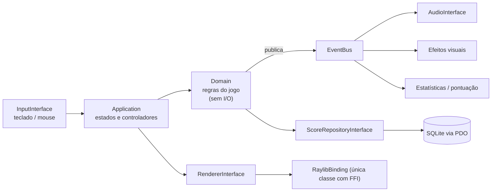

# Plano de Trabalho — Jogo Roguelike em PHP

**Revisão 3 (enxuta)** · 2026-09-18 · Equipe de 4 integrantes · Disciplina: Paradigmas de Programação

> Documento de escopo e arquitetura: o que construir, como está organizado e o que falta
> decidir. Cronograma, divisão de tarefas e acompanhamento ficam fora daqui, nas issues do
> repositório.
>
> **Convenção de marcação:** `[RF/RNF]` = exigência literal do enunciado ·
> `[SUGESTÃO]` = proposta da equipe, não exigida pelo enunciado ·
> `[SUPOSIÇÃO]` = lacuna ou contradição do enunciado preenchida provisoriamente, pendente de
> confirmação com o professor (§5).
>
> **Os requisitos do enunciado não mudam.** Nada neste documento altera, reinterpreta ou
> reclassifica um requisito; tudo que a equipe acrescentou está marcado como sugestão.

---

## 1. Visão geral

Jogo roguelike de sobrevivência com **ataque automático**, no molde de *Vampire Survivors*,
com ambientação inspirada em Minecraft. O jogador controla **apenas a movimentação**; as
armas disparam sozinhas conforme seus cooldowns, enquanto ondas progressivamente mais fortes
de inimigos surgem no mapa.

O ciclo de uma partida: sobreviver → acumular experiência → subir de nível → escolher uma
evolução (arma nova, melhoria de arma ou item passivo) → enfrentar o boss → registrar a
pontuação no ranking.

### 1.1 Restrições

| Item | Definição |
| --- | --- |
| Equipe | 4 integrantes |
| Prazo | 8 semanas |
| Linguagem | PHP 8.3+, exclusivamente — a equipe não escreve nem compila código em outra linguagem |
| Interface | Janela gráfica; terminal não é aceito como interface do jogo |
| Persistência | Banco de dados relacional (RNF01) |
| Entrega | Jogo executável, código-fonte e apresentação |

### 1.2 Tecnologias

| Camada | Escolha | Observação |
| --- | --- | --- |
| Linguagem | PHP 8.3+ | Exigência da disciplina; o FFI requer 8.1+ |
| Renderização | Raylib via FFI | O PHP não abre janela nativamente; o `libraylib` é binário pronto e o FFI é recurso oficial do PHP. **Liberado pelo professor** — ver §5.0 |
| Banco | SQLite 3 via PDO | Arquivo local, sem servidor a instalar; atende o RNF01 |
| Autoload | Composer, PSR-4 | Depende da pendência P06 |
| Testes | PHPUnit | Dependência de desenvolvimento; não entra no jogo em execução |
| Qualidade | PHPStan, Laravel Pint | Dependências de desenvolvimento |
| Assets | Sprites próprios ou de domínio público (ex.: Kenney, CC0) | Nunca arquivos originais do Minecraft. Origem e licença registradas em `assets/CREDITOS.md` |
| Prototipagem de telas | HTML e CSS | **Liberados pelo professor**, sem JavaScript. Usados **fora do jogo** — ver §3.8 |

### 1.3 Decisões que o enunciado deixou ao grupo

O enunciado marca quatro pontos como "a critério do aluno". Ficam registrados aqui para
evitar retrabalho:

- **Condição de vitória e de derrota (RF09).** **Derrota:** os pontos de vida do personagem
  chegarem a zero, com apresentação da pontuação e das informações da partida. **Vitória:**
  derrotar o boss, que surge aos 10 minutos de sobrevivência. Confirmado com o professor
  (§5.0, P01). Decisão da equipe, dentro do que o RF09 deixa em aberto: a partida continua
  após a vitória em modo livre, até a morte do personagem, para que o jogador possa aumentar
  a pontuação.
- **Fórmula de pontuação (RF32).** `P = (N × 100) + (I × 10) + (T × 2) + (V × 500)`, onde `N`
  é o nível alcançado, `I` os inimigos derrotados, `T` o tempo em segundos e `V` vale 1 em
  caso de vitória e 0 caso contrário.
- **Critério de desempate (RF34).** Com a mesma pontuação, vence quem sobreviveu **menos**
  tempo, premiando eficiência. Persistindo o empate, vence a partida mais antiga.
- **Fórmula de nível (RF13).** A sugerida pelo enunciado: níveis 0–15 usam `2n + 7`; níveis
  16–30 usam `5n − 38`; níveis 31+ usam `9n − 158`.

---

## 2. Escopo

### 2.1 Requisitos funcionais obrigatórios

A coluna **Depende de** indica o que precisa existir antes.

| Req. | Resumo | Sistema | Depende de |
| --- | --- | --- | --- |
| RF01 | Menu inicial com Iniciar / Ranking / Instruções / Sair | Estados e telas | Renderer, máquina de estados |
| RF02 | Seleção de personagem (≥2, atributos e passiva próprios) | Preparação da partida | RF01, RF16, RF17 |
| RF03 | Inicialização da partida (mapa, posicionamento, subsistemas) | Loop de jogo | RF02 |
| RF04 | Movimentação por teclado ou mouse | Entrada e movimento | RF03 |
| RF05 | Geração progressiva de inimigos por nível e regra de surgimento | Spawn / diretor de ondas | RF03, RF13, RF22-a |
| RF06 | Ataque automático conforme cooldown | Combate | RF18, RF20 |
| RF07 | Direcionamento automático por tipo de arma (**mínimo 4 armas**) | Combate / mira | RF06, RF22-a |
| RF08 | Sistema de dano: arma→inimigo e inimigo→jogador; morte em HP 0 | Combate / colisão | RF07, RF22-a |
| RF09 | Verificação de fim de jogo: derrota em HP 0; vitória a critério do grupo | Ciclo da partida | RF08, RF22-b |
| — | *RF10 não existe no enunciado* — ver P03 | — | — |
| RF11 | XP ao derrotar inimigo, quantidade por tipo | Progressão | RF08 |
| RF12 | Acúmulo de XP durante a partida | Progressão | RF11 |
| RF13 | Evolução de nível por fórmula em três faixas | Progressão | RF12 |
| RF14 | Tela de level up: pausa a ação e oferece 3 opções | Estados + progressão | RF13, RF18, RF19, RF21 |
| RF15 | Limite inicial de 2 armas equipadas | Inventário | RF14 |
| RF16 | Steve: 20 HP, 1 HP a cada 30 s, Stone Sword | Personagens | RF18 |
| RF17 | Alex: 16 HP, 1 HP a cada 15 s, Bow and Arrow | Personagens | RF18 |
| RF18 | Armas com comportamento, dano e cooldown próprios | Combate | RF03 |
| RF19 | Evolução de armas no level up ou em baús | Progressão / upgrades | RF18, RF14, RF26 |
| RF20 | Cooldown individual por arma | Combate | RF18 |
| RF21 | Itens passivos adquiridos no level up | Progressão | RF14 |
| RF22-a | Variedade de inimigos: **mínimo 3**, atributos próprios | Inimigos | RF05 |
| RF22-b | **Boss**, com atributos distintos dos inimigos comuns | Inimigos | RF22-a, RF29 |
| — | *RF23, RF24 e RF25 não existem no enunciado* — ver P03 | — | — |
| RF26 | Geração de baús após derrotar o boss, com raridades | Recompensas | RF22-b, RF19 |
| RF27 | Item de cura | Recompensas | RF26 |
| RF28 | Escalonamento progressivo de dificuldade | Dificuldade | RF05, RF30 |
| RF29 | Sistema de ondas com intensidades variáveis | Dificuldade | RF05 |
| RF30 | Registro do tempo total de sobrevivência | Ciclo da partida | RF03 |
| — | *RF31 não existe no enunciado* — ver P03 | — | — |
| RF32 | Cálculo de pontuação ao final da partida | Pontuação | RF30, RF13, RF08 |
| RF33 | Cadastro do nome do jogador, associado à partida | Pontuação | RF32 |
| RF34 | Ranking ordenado por pontuação decrescente, com desempate | Persistência | RF33, RNF01 |

### 2.2 Requisitos funcionais adicionais

O enunciado exige **no mínimo 2**. Por decisão da equipe, **os cinco são escopo firme** — não
há requisito adicional condicional ou cortável.

| Req. | Resumo | Conteúdo mínimo | Depende de | Esforço |
| --- | --- | --- | --- | --- |
| RF35 | Eventos aleatórios | ≥2 eventos: Horda e Chuva de XP | RF29 | ~6 ph |
| RF36 | Inimigos especiais | ≥2: Slime que se divide ao morrer e inimigo à distância | RF22-a | ~8 ph |
| RF37 | Evoluções especiais por combinação | ≥2 combinações (ex.: Stone Sword + Sharpness → Enchanted Stone Sword) | RF19, RF21 | 8–10 ph |
| RF38 | Drops de elementos do cenário | Elementos quebráveis que deixam itens: alimento, itens especiais, bônus temporários | RF27, geração do mapa | 12–16 ph |
| RF39 | Passiva única por personagem | 1 passiva distinta por personagem implementado | RF16, RF17, RF13 | ~6 ph |

**Consequências desta decisão, para constar.**

O RF38 é o mais caro do conjunto e o único que exige um sistema que nenhum outro requisito
pede: elementos destrutíveis posicionados no mapa, com colisão própria, evento de quebra e
tabela de drops. O RF37 depende de o RF19 e o RF21 estarem estáveis, porque reutiliza o
pipeline de modificadores (§3.4) — implementá-lo antes disso custa retrabalho.

Somados, os cinco consomem 40 a 46 ph, contra 20 ph das três versões firmes anteriores. Com
os testes agora obrigatórios (§5.0, P04), a folga do orçamento praticamente desaparece. As
horas saem dos acréscimos da equipe, nunca de requisito: remapeamento de teclas, tela de
estatísticas de fim de partida e overlay de depuração somam de 11 a 14 ph e são os primeiros
a cair. **O simulador sem janela não entra nessa lista**: com o RNF03 obrigatório, ele deixou
de ser conveniência e passou a ser a ferramenta que sustenta os testes.

### 2.3 Requisitos não funcionais

| Req. | Resumo | Como é atendido | Verificação |
| --- | --- | --- | --- |
| RNF01 | Banco relacional para o ranking | SQLite 3 via PDO, atrás de `ScoreRepositoryInterface` | O ranking sobrevive a fechar e reabrir o jogo |
| RNF02 | Código modular com separação de responsabilidades | MVC com domínio puro + padrões da §3.3 | PHPStan + regra "domínio não importa FFI" |
| RNF03 | Testes unitários das regras de negócio — **obrigatórios** (§5.0, P04), embora o enunciado escrito diga "Opcional/Boas práticas" | PHPUnit sobre dano, cooldown, XP, nível, spawn e pontuação | Suíte verde, cobrindo as seis regras citadas no enunciado |
| — | *RNF04 não existe no enunciado* — ver P03 | — | — |
| RNF05 | Feedback visual e sonoro para eventos importantes | `EventBus` com assinantes de áudio e de efeito visual | Checklist dos 7 eventos abaixo |
| RNF06 | Desempenho estável com muitos inimigos | Passo de tempo fixo, object pool e grade espacial (§3.5) | Orçamento de 16,6 ms por quadro |

**Os 7 eventos do RNF05:** dano ao personagem, inimigo atingido, inimigo derrotado, level up,
abertura de baú, morte do jogador e obtenção de item. Cada um é um evento tipado no
`EventBus`, e a ausência de assinante é detectada por teste.

---

## 3. Arquitetura e padrões

### 3.1 A regra central

O RNF02 pede código modular com separação de responsabilidades, citando MVC como exemplo. O
padrão adotado é **MVC com domínio puro**, e se resume a uma regra verificável:

> **Nenhuma classe de regra de jogo importa Raylib, chama FFI ou desenha na tela.**

Três consequências práticas: o domínio é testável com PHPUnit sem abrir janela (RNF03); o
jogo roda por inteiro sem janela, para balanceamento e testes de regressão; e a equipe
trabalha em paralelo desde o primeiro dia, sem esperar pela renderização.

### 3.2 Camadas



| Camada | Pode depender de | Nunca depende de |
| --- | --- | --- |
| `Domain` | apenas de si mesma e do PHP padrão | Application, Infrastructure, FFI |
| `Application` | Domain, interfaces de Infrastructure | implementações concretas de Raylib |
| `Infrastructure` | Domain (para implementar interfaces) | Application |

Regra verificável no CI: nenhum arquivo fora de `src/Infrastructure/Ffi/` contém a string
`FFI::`.

### 3.3 Padrões aplicados, por requisito

| Padrão | Onde | Requisito que justifica |
| --- | --- | --- |
| **State** | `StateStack` de telas e pausa; fases do boss | RF01, RF02, RF09, RF14, RF22-b |
| **Observer** | `EventBus` e assinantes de áudio, efeito e pontuação | RNF05, RF32 |
| **Strategy** | mira das armas, comportamento dos inimigos, política de ondas | RF07, RF22-a, RF29, RF36 |
| **Factory** | `EnemyFactory`, `WeaponFactory`, `ChestFactory` | RF05, RF18, RF26 |
| **Flyweight** | `EnemyArchetype`, `WeaponDefinition` — dados imutáveis compartilhados por tipo | RNF06, RF22-a |
| **Object Pool** | projéteis, gemas de XP, números de dano | RNF06 |
| **Repository** | `ScoreRepositoryInterface` + `SqliteScoreRepository` | RNF01, RF34 |
| **Adapter / Facade** | `RaylibRenderer`, `RaylibAudio` e a classe única `RaylibBinding` | RNF02, RNF05 |
| **Null Object** | `NullRenderer`, `NullAudio`, `ScriptedInput` — o jogo roda sem janela | RNF02, RNF03 |
| **Injeção de dependência** | `bootstrap()` em `jogo.php`; sem singletons | RNF02, RNF03 |

**ECS foi considerado e recusado:** o ganho aparece em escalas que este projeto não tem, e o
custo (construir e depurar o armazenamento de componentes, mais a curva de aprendizado de
quatro pessoas) não se paga em 8 semanas. O que se aproveita dele é a **composição no lugar
da herança profunda**: comportamento por `Strategy` injetada, capacidades por interfaces
pequenas (`Damageable`, `Movable`, `Collidable`).

### 3.4 Evolução de atributos

Upgrades de arma (RF19), itens passivos (RF21), passivas de personagem (RF39) e evoluções
especiais (RF37) mexem nos mesmos números. Em vez de decoradores encadeados, que embaralham a
ordem das contas, todos viram um **pipeline de modificadores**:

```
StatModifier { atributo, tipo: FLAT | PERCENT, valor, origem }
resolução: base → soma dos FLAT → produto dos PERCENT
```

Quatro requisitos passam a usar o mesmo mecanismo, e a conta final é verificável com uma
tabela de teste.

### 3.5 Desempenho (RNF06)

| Métrica | Alvo |
| --- | --- |
| Tempo por quadro | ≤ 16,6 ms (60 FPS) |
| Inimigos simultâneos | 300 sem cair abaixo de 50 FPS |
| Projéteis simultâneos | 200 (teto do pool) |
| Verificações de colisão | < 40 por entidade por quadro |
| Tempo até o menu | < 3 s |

Três técnicas sustentam isso, e as três são estruturais — implementá-las depois custa
reescrita:

1. **Passo de tempo fixo** de 1/60 s com interpolação na renderização. Sem ele, cooldown
   (RF20) e regeneração (RF16, RF17) dependem da velocidade da máquina.
2. **Object pool** para projéteis, gemas e números de dano, com teto. Evita pressão de coletor
   de lixo dentro do laço.
3. **Grade espacial** (células de 64 px, reconstruída a cada quadro) para a colisão. Todos
   contra todos daria 60 000 pares por quadro; a grade derruba para dezenas por entidade.

Complementos: `Rng` semeado e injetado, para que spawn, drops e sorteios sejam reproduzíveis
e testáveis; e OPcache com JIT no CLI (`opcache.enable_cli=1`, `opcache.jit_buffer_size=64M`,
`opcache.jit=tracing`), a validar junto com o FFI.

### 3.6 Configuração guiada por dados

Atributos ficam fora do código, em JSON validado na carga — um arquivo malformado falha na
inicialização com mensagem clara, e não vira `NaN` no meio do combate:

```
config/
  characters.json   vida, regeneração, arma inicial, passiva      (RF16, RF17, RF39)
  weapons.json      dano, cooldown, alcance, projéteis, mira      (RF18, RF20)
  upgrades.json     modificadores por nível de melhoria            (RF19)
  passives.json     itens passivos e seus modificadores            (RF21)
  enemies.json      arquétipos comuns, especiais e boss            (RF22-a, RF22-b, RF36)
  waves.json        intensidade por faixa de tempo e escalonamento (RF28, RF29)
  chests.json       raridades e probabilidades                     (RF26)
  evolutions.json   combinações arma + item e resultado             (RF37)
  scenery.json      elementos quebráveis e suas tabelas de drop     (RF38)
  events.json       eventos aleatórios e condições                 (RF35)
```

### 3.7 Estrutura de pastas

```
jogo.php                 ponto de entrada + bootstrap()
config/                  JSON de balanceamento (§3.6)
assets/                  sprites, áudio, fontes, CREDITOS.md
lib/                     libraylib (binário, FORA do Git)
database/migrations/     NNN_*.sql versionados; o .sqlite fica fora do Git

src/
  Core/                  GameLoop, StateStack, EventBus, ObjectPool,
                         SpatialHash, Rng, Config
  Domain/                REGRAS DO JOGO — sem Raylib, sem FFI, sem I/O
    Entity/                Player, Enemy, Boss, Projectile, Chest, Pickup,
                           Breakable (RF38)
    Weapon/                Weapon, Targeting/, Upgrade/
    Character/             Steve, Alex e passivas
    Ai/                    Steering/, Behavior/, Boss/, WorldView (§4)
    System/                Movement, Collision, Damage, Xp, WaveDirector,
                           EventDirector, ScoreCalculator
    Event/                 eventos tipados do EventBus
    Factory/               EnemyFactory, WeaponFactory, ChestFactory
    Value/                 Vector2, Stats, Cooldown, Health
    Repository/            ScoreRepositoryInterface
  Application/
    State/                 Menu, CharacterSelect, Play, LevelUp, Pause,
                           GameOver, Ranking, Instructions
    Service/               MatchService, RunSummary
  Infrastructure/
    Ffi/                   RaylibBinding — ÚNICO arquivo com FFI::
    Render/                RendererInterface, RaylibRenderer, NullRenderer, Hud
    Audio/                 AudioInterface, RaylibAudio, NullAudio
    Input/                 InputInterface, RaylibInput, ScriptedInput
    Persistence/           Connection, Migrator, SqliteScoreRepository

tools/                   utilitários em PHP, fora do jogo
tests/                   Unit/, Integration/, Simulation/
```

`lib/` e `database/*.sqlite` ficam fora do Git: binário versionado gera conflito de merge
irresolúvel. Versiona-se o `database/migrations/`, e o README explica como obter o
`libraylib` da versão correta.

### 3.8 Onde HTML e CSS entram

O professor liberou HTML e CSS, **sem JavaScript**. Isso não muda a interface do jogo: sem
JS, o navegador não consegue nem movimentação contínua pelo teclado (RF04) nem laço em tempo
real (RF06, RF20, RNF06) — a única atualização possível seria recarregar a página. A interface
do jogo continua sendo a janela do Raylib, uma só.

**Regra:** nada de HTML ou CSS dentro do jogo em execução. Eles ficam no entorno — desenhar
antes, medir depois.

**Uso 1 — Protótipo das telas (recomendado, ~4–6 ph).** Menu, seleção de personagem, HUD,
tela de level up, game over e ranking são montados primeiro como páginas HTML/CSS estáticas.
Editar, salvar e atualizar o navegador é um ciclo de segundos; posicionar retângulos direto no
código e reabrir o jogo a cada ajuste de cinco pixels, não. O layout aprovado é então
implementado no Raylib com posições e tamanhos já definidos. A tela de level up (RF14) é onde
mais rende, por ser a de layout mais complexo. Os protótipos ficam em `docs/telas/` e são
versionados junto com o código.

**Uso 2 — Ferramentas de apoio (opcional, ~6–10 ph).** Páginas geradas pelo PHP e servidas por
`php -S`, fora do jogo e sem JavaScript:

- **Painel de balanceamento:** lê `config/*.json` e mostra a curva de XP por nível (RF13),
  dano e cooldown por arma, atributos por inimigo e a linha do tempo de ondas. Gráficos de
  barra são `<div>` com largura percentual em CSS. Formulários POST reescrevem o JSON, o que
  permite balancear sem abrir editor de texto.
- **Relatório do simulador:** o `tools/simulate.php` passa a gerar um HTML em vez de texto no
  terminal — nível ao longo do tempo, mortes por tipo, dano por arma, pontuação. Comparar
  sementes lado a lado fica legível.
- **Navegador do ranking:** lê o mesmo SQLite e lista as partidas, para conferir o RF34 e o
  critério de desempate sem precisar jogar.

**Recusado: menus do jogo no navegador.** É tecnicamente possível — menus não são tempo real
e links funcionam sem JS —, mas criaria duas interfaces, com uma passagem frágil entre o
navegador e o processo do jogo, além de duplicar telas que o RF01 e o RF34 exigem dentro do
jogo de qualquer forma.

---

## 4. IA de comportamento

> **Acréscimo da equipe.** O enunciado não exige nada desta seção. O que está aqui reforça o
> RF22-b (boss com atributos distintos dos comuns) e implementa o inimigo à distância do RF36,
> mas a forma escolhida é decisão nossa, não exigência. `[SUGESTÃO]`

Nada disto é aprendizado de máquina. São regras determinísticas em duas camadas: um vetor de
direção por inimigo a cada passo fixo, e uma máquina de estados no boss. Os padrões são os
mesmos já usados em outros pontos do projeto — **Strategy** para escolher o comportamento e
**State** para a fase do boss (§3.3).

### 4.1 Separação entre inimigos · 4–6 ph

**O problema.** Todo inimigo persegue o jogador em linha reta. Como todos miram o mesmo ponto,
todos convergem para o mesmo lugar: em trinta segundos, trezentos inimigos ficam sobrepostos
ocupando o espaço de um. O resultado é feio e injusto — o jogador não consegue ver quantos
inimigos tem em cima dele.

Isso tem consequência direta sobre o RNF06. O requisito manda demonstrar muitos inimigos
simultâneos com desempenho estável, e sem separação a tela mostra um borrão, não trezentos
inimigos.

**Como funciona.** Cada inimigo soma duas vontades por passo:

1. **Seek** — ir na direção do jogador: `normalizar(posJogador − posInimigo) × velocidadeMax`.
2. **Separation** — afastar-se de quem está colado: para cada vizinho a distância `d` menor que
   o raio de separação, acumula `normalizar(posInimigo − posVizinho) / d`. A divisão por `d` é
   o que faz vizinho colado empurrar muito e vizinho distante empurrar pouco.

A direção final é `normalizar(w_seek × seek + w_sep × separation)`, com pesos e raio em
`config/enemies.json`.

**Por que é barato.** A grade espacial (§3.5) já consulta as 9 células vizinhas a cada quadro
para a colisão. A separação **reaproveita a mesma consulta** — custa algumas subtrações por
vizinho, não uma varredura nova. Sem a grade, seria todos contra todos, cerca de 90 000 pares
por quadro. A grade espacial é pré-requisito duro desta melhoria, não detalhe.

**Kiting, e por que não é acréscimo.** O mesmo mecanismo, com três faixas de distância e uma
margem de histerese para não tremer, produz o inimigo à distância exigido pelo **RF36**. Ali
não é proposta da equipe: é a forma de implementar um requisito.

| Distância até o jogador | Comportamento |
| --- | --- |
| menor que a ideal | foge (vetor invertido) |
| dentro da margem | orbita (vetor perpendicular) e atira |
| maior que ideal + margem | persegue |

### 4.2 Boss em fases · ~6 ph

**O problema.** O RF22-b exige que o boss tenha atributos diferentes dos inimigos comuns. Dá
para cumprir isso apenas multiplicando números — 400 de vida, 15 de dano —, mas o resultado é
um inimigo comum gordo: comporta-se igual a todos os outros, e a luta vira esperar o cooldown
das armas.

**As seis fases.**

| Fase | Entra quando | Comportamento |
| --- | --- | --- |
| `Perseguindo` | padrão | seek com peso alto, separação baixa |
| `Telegrafando` | cooldown de investida zerou (~8 s) | para, pisca e trava a direção — **0,8 s** |
| `Investindo` | fim do telegrafar | avança em linha reta a 3× a velocidade, ~1 s |
| `Recuperando` | fim da investida | imóvel e vulnerável, 1 s |
| `Invocando` | vida cruza 70% e 40% | gera um grupo de inimigos comuns pela `EnemyFactory` |
| `Enfurecido` | vida abaixo de 25% | +30% velocidade, −30% cooldown, até o fim da luta |

**Os dois detalhes que importam.** A fase `Telegrafando` parece desperdício — o boss fica
parado sem atacar — e é a mais importante das seis: ela avisa o jogador do que vem. Sem ela, a
investida é instantânea e a morte parece roubo; com ela, a luta vira leitura e reação. A fase
`Recuperando` é o complemento: a janela em que o jogador é premiado por ter desviado.

Limiares, durações e multiplicadores ficam em `config/enemies.json`.

### 4.3 O contrato

Um só, para as duas: `BehaviorStrategy.decidir(inimigo, visãoDoMundo, dt)` devolve um vetor de
direção. A `WorldView` é uma interface **somente leitura** — posição do jogador e consulta de
vizinhos. A IA não consegue alterar o mundo nem que queira, o que elimina de antemão a classe
de bug mais difícil de rastrear nesse tipo de sistema, e mantém o comportamento testável sem
abrir janela.

Com o RNF03 agora obrigatório (§5.0, P04), isso deixa de ser elegância e vira necessidade: sem
esse isolamento, comportamento emergente só é avaliável no olho. Com ele, vira asserção —
*"após 3 s, a menor distância entre 50 inimigos é maior que 12 px"*.

O código mora em `src/Domain/Ai/` (§3.7).

### 4.4 Diretor adaptativo · 6–8 ph · **pendente de decisão**

> **Não entra no escopo firme.** Está descrito para que a decisão seja tomada com informação,
> e não no impulso. A decisão fica para a semana 7; até lá, ninguém implementa.

O RF28 e o RF29 exigem uma curva fixa de dificuldade, igual para todo jogador. O diretor
adaptativo mede a **pressão** sobre o jogador — percentual de vida, tempo desde o último dano,
inimigos mortos por segundo, densidade de inimigos próximos, todos sinais que o `EventBus` já
publica — e ajusta o surgimento: alivia quando a pressão está alta há muito tempo, aperta
quando está baixa, e dispara a Horda do RF35 no momento em que ela faz sentido, em vez de no
dado.

**A trava que preserva o RF28:** o diretor não substitui a curva obrigatória. Oscila no máximo
±25% em torno dela, com piso e teto. A dificuldade continua subindo com o tempo e o nível
exatamente como o requisito manda.

**Por que está pendente.** É invisível na tela, ao contrário de §4.1 e §4.2. É difícil de
calibrar sem dezenas de execuções do simulador. E, com a mão pesada, premia jogar mal e pune
jogar bem, o que o jogador sente como injustiça. Se entrar, precisa da chave
`"diretorAdaptativo": false` em `config/waves.json`, porque um diretor que reage ao jogador
quebra a reprodutibilidade por semente de que os testes dependem.

---

## 5. Pendências a confirmar com o professor

As pendências em aberto têm uma **suposição adotada**, para que o trabalho não pare esperando
resposta. **P06 deve ser levada ao professor antes da semana 2**, por decidir 10 a 14 horas de
trabalho.

### 5.0 Resolvidas

| # | Ponto | Resposta do professor | Consequência |
| --- | --- | --- | --- |
| **P01** | O RF09 fala em "navios inimigos destruídos" e "navios aliados afundados", incompatível com um roguelike de um único personagem | **É erro de digitação; o trecho é ignorado.** Vale o texto seguinte do próprio RF09 | **Derrota:** pontos de vida do personagem chegarem a zero, com apresentação da pontuação e das informações da partida. **Vitória:** derrotar o boss aos 10 minutos. Nenhum sistema de embarcações é implementado |
| **P02** | Os dois requisitos numerados RF22 ("Variedade de Inimigos, mínimo 3" e "Boss(es)") | **Ponto encerrado** | Seguem sendo dois requisitos distintos e ambos obrigatórios, chamados internamente RF22-a e RF22-b, com o rótulo RF22 preservado nas entregas |
| **P03** | Faltam RF10, RF23, RF24, RF25, RF31 e RNF04 | **Ponto encerrado** | Os números não existem: são restos de numeração de uma versão anterior. **Nada é implementado para preenchê-los.** A §2 registra cada ausência para que ninguém volte a procurá-los |
| **P04** | O RNF03 marca os testes unitários como "Opcional/Boas práticas", mas lista seis regras específicas a validar | **Os testes são obrigatórios** | O RNF03 deixa de ser cortável e passa a valer como qualquer outro requisito. As seis regras citadas — cálculo de dano, cooldown das armas, ganho de XP, evolução de nível, geração de inimigos e cálculo de pontuação — precisam de teste, e a suíte entra na verificação de entrega |
| **P05** | O uso do Raylib via FFI atende à regra de linguagem única? | **Sim, o FFI está liberado** | A escolha de renderização está confirmada. O spike da semana 1 continua valendo, mas agora é validação técnica (ABI, `struct` por valor, JIT), não decisão de viabilidade |
| **P09** | Quantos requisitos adicionais contam para a nota? O enunciado pede no mínimo 2 | **Encerrada por decisão da equipe** | Os cinco (RF35 a RF39) passam a escopo firme, acima do mínimo exigido. A resposta do professor deixou de afetar o que será construído — ver §2.2 |
| **P11** | HTML e CSS podem ser usados na interface? | **Sim, mas sem JavaScript** | Não altera a interface do jogo, que segue sendo a janela do Raylib. HTML/CSS entram como protótipo de telas e ferramentas de apoio — ver §3.8 |

### 5.1 Em aberto — perguntas sobre regras do trabalho

| # | Pergunta | Suposição adotada `[SUPOSIÇÃO]` | Impacto se divergir |
| --- | --- | --- | --- |
| **P06** | **Bibliotecas externas via Composer são permitidas?** Há distinção entre dependências de execução e de desenvolvimento (PHPUnit, PHPStan, Pint, que não entram no jogo)? | Permitidas, com preferência por poucas e fixadas no repositório | Médio. Sem Composer, o autoload vira manual e as assinaturas FFI passam a ser escritas à mão |
| **P07** | **Assets de terceiros em domínio público (CC0, como os pacotes Kenney) são permitidos**, com os devidos créditos? | Permitidos, com `assets/CREDITOS.md` listando origem e licença | Médio. Se só valerem assets próprios, é preciso orçar tempo de arte |
| **P08** | **Como o trabalho será executado na avaliação?** Na máquina da equipe, na do professor, ou entregue como pacote? Se for em máquina de terceiro, é necessário PHP 8.3 com FFI habilitado e o `libraylib` presente | Demonstração na máquina da equipe, com vídeo de reserva gravado e README completo | Alto. Empacotar para máquina desconhecida é trabalho não orçado |
| **P10** | **A avaliação é do grupo ou individual?** Há expectativa de rastrear contribuição por integrante? | Nota de grupo, com histórico de commits atribuível de qualquer forma | Baixo |
